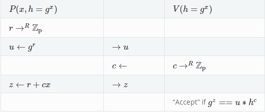

# Zero Knowledge Proof Research

For this project I am conducting research and implementing Zero Knowledge Proofs (ZKPs) and seeing their potential in GPU based system design. I am also generating comprehensive project documentation to communicate research findings and contribute to knowledge dissemination in ZKPs and GPU-based systems.

This project will detail a report of different implementations of ZKP equations focusing on Schnorr's Protocol. Schnorrs Protocol is a mathematical equation that is an Honest-verifier zero knowledge (HVZK) proof. The Schnorr signature scheme is a robust and efficient digital signature algorithm widely used in modern cryptographic applications. It relies on the hardness of mathematical problems, such as the discrete logarithm problem, to provide security. One of its notable features is signature aggregation, allowing multiple signatures to be combined into a single signature. This property offers benefits like improved scalability and privacy, making it an attractive choice for various blockchain and cryptocurrency protocols. With smaller key sizes and strong security guarantees, the Schnorr signature scheme continues to be a significant advancement in digital signature technology.

A quick review of the math is shown below given the equations and exchange of information between verifier and prover. 



## Table of Contents

- [Project Title](#Zero-Knowledge-Proof-Research)
- [Introduction](#introduction)
- [Features](#features)
- [Installation](#installation)
- [Usage](#usage)
- [Contributing](#contributing)
- [License](#license)

## Introduction


## Features

List the key features and functionalities of your project. This section helps users understand what your project can do.

## Installation

Sigma_protocol.py

Python3 needs to be installed to run this program. Once installed run :
`python sigma_protocol.py`
-or-
`python3 sigma_protocol.py`

Barretts.c
GBD needs to be installed to run this program. Once installed run :

```
// Compile
gcc -c -g multiplier.c  ;
gcc -c -g subtraction.c  ;
gcc -c -g shifting.c  ;
gcc -c -g findK.c  ;
gcc -c -g Barretts.c   ;
gcc -o main Barretts.o multiplier.o subtraction.o shifting.o findK.o

// clean up
rm *.o ; rm *.exe 
```

## Usage

Purely for educational purposes in learning about Zero Knowledge Proofs.

## Contributing

Haodong Wang, PHD
_Profesor overseeing research, and assisting in production_

**Resources**
_https://codethechange.stanford.edu/guides/guide_zk.html_

## License

General MIT license
